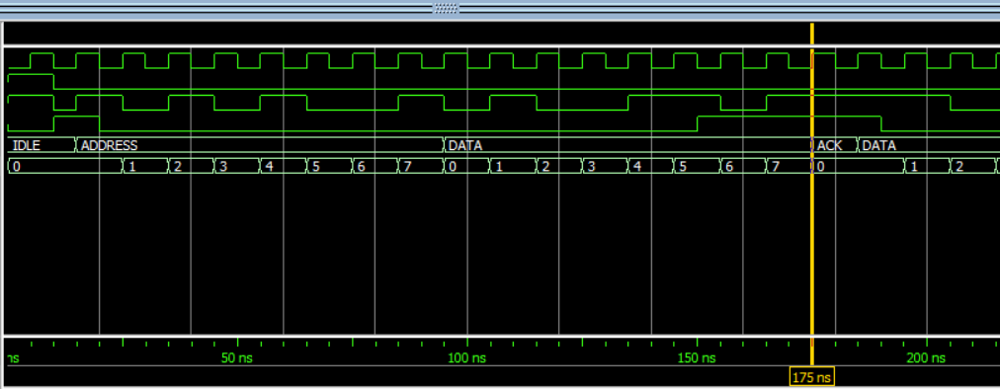

# I2C Transmitter

This project implements an I2C (Inter-Integrated Circuit) controller, designed for digital design applications. The controller facilitates communication between a master device and one or more slave devices over the I2C protocol.

## Features

- Supports standard I2C protocol.
- Master transmits data and waits for ACK.



## Directory Structure

```
/rtl        # Source code for the I2C controller
/tb         # Testbenches and simulation files
```

## Getting Started

1. Clone the repository:
    ```sh
    git clone https://github.com/yourusername/I2C_controller.git
    ```
2. Run simulations using the provided testbenches.


## Requirements

- HDL simulator (e.g., ModelSim, Vivado, or GHDL)
- Basic understanding of I2C protocol

## Author

Ahmed Said
